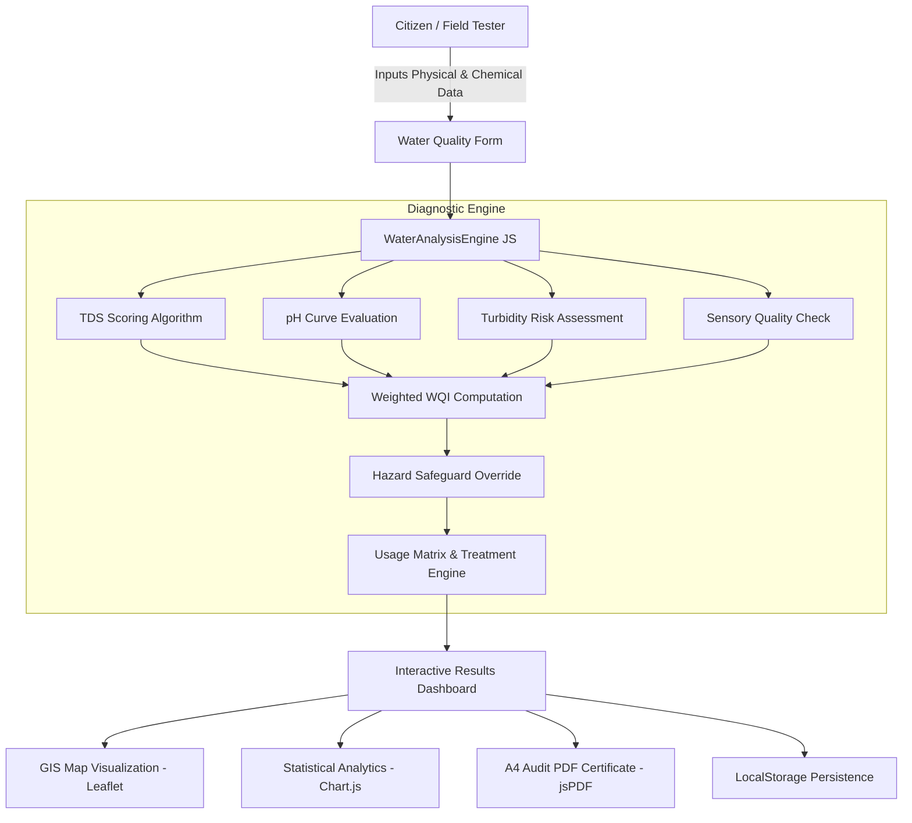

# 💧 Aqua Health Checker (v2.0 Pro)
### *Community-Driven Water Quality Intelligence & Health Assessment Platform*

[](LICENSE)
[](https://jaljeevanmission.gov.in/)
[](#-multilingual-support-i18n)
[](#%EF%B8%8F-technology-stack)
[](#-quick-start)

> **Aqua Health Checker** is an open-source, client-side, community-oriented water quality intelligence platform. It enables citizens, health workers, and panchayats to test, analyze, monitor, and protect local drinking water sources using standard physicochemical parameters with real-time scientific grading under 30 seconds.

---

## 📑 Table of Contents

- [✨ Key Features](#-key-features)
- [🔬 Scientific Assessment Engine](#-scientific-assessment-engine)
- [📊 Water Quality Standards & Benchmarks](#-water-quality-standards--benchmarks)
- [🗺️ Interactive GIS Water Database & Map](#%EF%B8%8F-interactive-gis-water-database--map)
- [📈 Analytics & Trend Visualizer](#-analytics--trend-visualizer)
- [📄 Instant PDF Diagnostic Reports](#-instant-pdf-diagnostic-reports)
- [🌐 Multilingual Support (i18n)](#-multilingual-support-i18n)
- [🎓 Water Academy & Knowledge Hub](#-water-academy--knowledge-hub)
- [🏗️ System Architecture & Workflow](#%EF%B8%8F-system-architecture--workflow)
- [📂 Project Directory Structure](#-project-directory-structure)
- [🚀 Quick Start & Installation](#-quick-start--installation)
- [🛠️ Technology Stack](#%EF%B8%8F-technology-stack)
- [🤝 Contributing](#-contributing)
- [📜 License](#-license)

---

## ✨ Key Features

```
  ┌──────────────────────────────────────────────────────────────────────────┐
  │                           AQUA HEALTH CHECKER                            │
  ├──────────────────┬──────────────────┬─────────────────┬──────────────────┤
  │  ⚡ Instant WQI   │  🗺️ Leaflet GIS  │  📊 Chart.js    │  📄 jsPDF Report │
  │   Diagnosis      │   Community Map  │   Analytics     │   Generator      │
  ├──────────────────┼──────────────────┼─────────────────┼──────────────────┤
  │  🌐 3 Languages  │  💡 Remediation  │  🌓 Dark/Light  │  💾 Offline-First│
  │   (EN / HI / MR) │   Action Engine  │   Modern UI     │   LocalStorage   │
  └──────────────────┴──────────────────┴─────────────────┴──────────────────┘
```

- **⚡ Instant 30-Second Diagnosis**: Input TDS, pH, Turbidity, Color, and Odor to receive an overall **Water Quality Index (WQI 0–100)** score, safety tier, and risk level.
- **🔬 Multi-Use Suitability Analysis**: Instant fitness matrix for **Drinking**, **Cooking**, **Bathing & Personal Hygiene**, **Gardening & Agriculture**, and **Domestic Cleaning**.
- **🚨 Automated Hazard & Problem Detection**: Diagnoses critical issues like chemical/sulfur odors, high/low pH extremes, silt contamination, and mineral hardness.
- **🛠️ Actionable Treatment Recommendations**: Provides tailored, scientifically backed remediation steps (e.g., Boiling, Chlorination, Activated Charcoal, Alum Flocculation, RO filtration, UV purification).
- **🗺️ Interactive GIS Community Map**: Visualizes tested water sources with color-coded safety pins, custom popups, search filters, and GPS geo-tagging via [Leaflet.js](https://leafletjs.com/).
- **📊 Longitudinal Trend Visualizer**: Tracks water quality over time with radar parameter benchmarks, quality distribution donuts, and historical test charts powered by [Chart.js](https://www.chartjs.org/).
- **📄 Client-Side PDF Diagnostic Reports**: Generates formal, downloadable, A4-formatted water health inspection certificates with [jsPDF](https://github.com/parallax/jsPDF).
- **🎓 Built-In Water Academy**: Educational guides covering WHO/BIS limits, field testing procedures, safe storage, and waterborne disease prevention.
- **🌐 Trilingual Internationalization**: Seamless real-time switching between **English**, **हिंदी (Hindi)**, and **मराठी (Marathi)**.
- **💾 100% Offline-Capable & Client-Side**: Powered by `localStorage` with preloaded seed datasets from real-world community water testing points.

---

## 🔬 Scientific Assessment Engine

The core assessment algorithm (`assets/js/engine.js`) implements a weighted multi-parameter index complying with **BIS 10500:2012** (Indian Standard for Drinking Water) and **World Health Organization (WHO)** water safety guidelines:

$$\text{WQI} = (S_{\text{TDS}} \times 0.35) + (S_{\text{pH}} \times 0.30) + (S_{\text{Turbidity}} \times 0.20) + (S_{\text{Sensory}} \times 0.15)$$

### Safety & Health Override Guardrails:
- If a severe hazard is detected (chemical odor, rotten egg $\text{H}_2\text{S}$, $\text{pH} < 5.0$, $\text{pH} > 10.0$, or $\text{TDS} > 2000 \text{ mg/L}$), the algorithm enforces an **immediate hazard ceiling** capping the overall score at $\le 28/100$ and triggers high-priority health alerts.

<details>
<summary><b>🔍 Click to expand: Parameter Scoring Algorithms & Logic</b></summary>

```javascript
// 1. Total Dissolved Solids (TDS in mg/L or ppm)
// Ideal: 50 - 300 mg/L | Acceptable: 300 - 500 mg/L | Permissible: 500 - 1200 mg/L
if (tds >= 50 && tds <= 300) score = 100;
else if (tds < 50) score = 75; // Low mineral content
else if (tds <= 500) score = 85;
else if (tds <= 900) score = 65;
else if (tds <= 1200) score = 45;
else if (tds <= 2000) score = 25;
else score = 10; // Severe mineral salinity

// 2. pH Scale (Acidity / Alkalinity)
// Ideal: 6.8 - 7.8 | Acceptable: 6.5 - 8.5
if (ph >= 6.8 && ph <= 7.8) score = 100;
else if (ph >= 6.5 && ph <= 8.5) score = 85;
else if (ph >= 6.0 && ph <= 9.0) score = 55;
else if (ph >= 5.0 && ph <= 10.0) score = 30;
else score = 5; // Extreme acidic or caustic water

// 3. Turbidity (NTU - Nephelometric Turbidity Units)
// Ideal: < 1.0 NTU | Acceptable: < 5.0 NTU
if (turbidity <= 1.0) score = 100;
else if (turbidity <= 3.0) score = 80;
else if (turbidity <= 5.0) score = 60;
else if (turbidity <= 10.0) score = 35;
else score = 15; // Suspended particles & high microbial risk
```
</details>

---

## 📊 Water Quality Standards & Benchmarks

| Parameter | Unit | Ideal Range (WHO / BIS) | Acceptable Limit (BIS 10500) | Permissible Max Limit | Health Significance |
| :--- | :--- | :--- | :--- | :--- | :--- |
| **TDS** | $\text{mg/L}$ (ppm) | **$50 - 300$** | $500$ | $1200$ | Mineral balance, taste, kidney & gastrointestinal health |
| **pH** | Scale ($0-14$) | **$6.8 - 7.8$** | $6.5 - 8.5$ | No Relaxation | Mucosal irritation, metal leaching, pipe corrosion |
| **Turbidity** | $\text{NTU}$ | **$< 1.0$** | $1.0$ | $5.0$ | Pathogen shielding, bacterial growth, silt suspension |
| **Color** | Visual | **Clear** | Slight tint | Unacceptable | Organic matter, iron/manganese, industrial runoff |
| **Odor** | Olfactory | **None / Odorless** | Mild Chlorine | Must be absent | Hydrogen sulfide, bacteria, sewage/industrial contamination |

---

## 🗺️ Interactive GIS Water Database & Map

```
   ┌──────────────────────────────────────────────────────────┐
   │ 🗺️ Community Water Source GIS Map                        │
   │  [📍 Safe Source (88+)]    [📍 Moderate (52-71)]         │
   │  [📍 Good Source (72-87)]  [📍 Unsafe Source (<32)]      │
   │                                                          │
   │  * Click any marker for instant parameter inspection     │
   │  * Geo-location picker with auto lat/lng coordinate sync │
   │  * Filter by Source Type: Well, Borewell, Tap, River...  │
   └──────────────────────────────────────────────────────────┘
```

- **Interactive Pinpoints**: Color-coded markers based on scientific quality classification:
  - 🟢 **Emerald**: Excellent ($\text{Score} \ge 88$)
  - 🔵 **Cyan**: Good ($\text{Score } 72 - 87$)
  - 🟡 **Amber**: Moderate ($\text{Score } 52 - 71$)
  - 🟠 **Orange**: Poor ($\text{Score } 32 - 51$)
  - 🔴 **Rose**: Unsafe / Critical Hazard ($\text{Score } < 32$)
- **Source Type Taxonomy**: Wells, Borewells / Tube Wells, Municipal Taps, Rivers, Lakes, Overhead Tanks, RO Plants, and Water Tankers.
- **Live Search & Filter**: Real-time filtering by village name, area, testing volunteer, or risk category.

---

## 📈 Analytics & Trend Visualizer

<details>
<summary><b>📊 Click to view Analytics Features</b></summary>

1. **Parameter Benchmark Radar**: Compares tested sample TDS, pH, and Turbidity directly against national WHO/BIS standard envelopes.
2. **Longitudinal History Line Chart**: Analyzes recurring tests over time for specific water points (e.g., pre-monsoon vs. post-monsoon sanitation).
3. **Quality Distribution Donut**: Summarizes the proportion of community water points that are Safe, Treatable, or Hazardous.
4. **Source Type Comparative Breakdown**: Compares average water quality across different source infrastructures.
</details>

---

## 📄 Instant PDF Diagnostic Reports

Generate formal, printable A4 water audit reports directly from your browser:

- 📑 **Official Report Header** with unique Auto-Generated Diagnostic ID (`AHC-YYYY-XXXX`).
- 🏷️ **Water Source Identity & GPS Metadata**.
- 🧪 **Full Parameter Analysis Matrix** with status badges and normal reference ranges.
- 💡 **Step-by-step Treatment Protocol & Boil/Filter Directives**.
- 🩺 **Clinical Health Warnings & Precautionary Advice**.
- ✍️ **Official Tester Signature & Verification Footer**.

---

## 🌐 Multilingual Support (i18n)

Aqua Health Checker is built to serve grassroots rural and urban communities:

| Language | Code | Region / Audience |
| :--- | :--- | :--- |
| **English** | `en` | Global / Urban Field Technicians |
| **हिंदी (Hindi)** | `hi` | National / Northern & Central India |
| **मराठी (Marathi)** | `mr` | Maharashtra Gram Panchayats & Community Groups |

---

## 🎓 Water Academy & Knowledge Hub

The application includes an interactive field education guide:
- 📖 **Water Quality Standards Decoded**: Explaining TDS, pH, and Turbidity in simple terms.
- 🧪 **Low-Cost Field Testing Guide**: Step-by-step guide for using TDS meters, pH test strips, and turbidity tubes.
- 🛡️ **Home Water Purification Guide**: Explaining SODIS (Solar Disinfection), Boiling, Chlorination dosing, and Filtration.
- 🦠 **Waterborne Illness Prevention**: Early symptom awareness for Cholera, Typhoid, Diarrhea, and Fluorosis.

---

## 🏗️ System Architecture & Workflow



---

## 📂 Project Directory Structure

```
Field-Project/
├── index.html                  # Single-page application shell & all views
├── assets/
│   ├── css/
│   │   └── style.css           # Glassmorphism, animations, print & custom styling
│   └── js/
│       ├── app.js              # Application controller, view routing & event binding
│       ├── engine.js           # BIS/WHO scientific water diagnostic algorithm
│       ├── storage.js          # LocalStorage CRUD manager & pre-seeded test data
│       ├── map.js              # Leaflet.js interactive map & coordinate handlers
│       ├── charts.js           # Chart.js analytics & parameter radar renders
│       ├── reports.js          # jsPDF formal water audit generator
│       └── i18n.js             # English, Hindi & Marathi internationalization dictionary
└── README.md                   # Comprehensive documentation & user guide
```

---

## 🚀 Quick Start & Installation

### Option 1: Zero-Install Instant Browser Launch
No build tools, bundlers, or server runtimes required!

1. **Clone the repository**:
   ```bash
   git clone https://github.com/aryan-mlhub/Field-Project.git
   cd Field-Project
   ```

2. **Open directly in your browser**:
   - Double-click `index.html`, or
   - Right click `index.html` $\rightarrow$ Open With $\rightarrow$ Google Chrome / Firefox / Edge / Safari.

### Option 2: Run with a Local Static Server
If you prefer running through a lightweight local server:

```bash
# Using Python 3:
python -m http.server 8080

# Or using Node.js npx:
npx serve .
```
Then navigate to `http://localhost:8080` in your web browser.

---

## 🛠️ Technology Stack

- **Core Structure**: HTML5, Semantic Web Elements
- **Styling & UI**: [Tailwind CSS](https://tailwindcss.com/) (CDN) + Custom Glassmorphic Dark/Light theme CSS
- **Interactive Mapping**: [Leaflet.js](https://leafletjs.com/) (OpenStreetMap tiles)
- **Data Visualization**: [Chart.js](https://www.chartjs.org/)
- **Document Generation**: [jsPDF](https://github.com/parallax/jsPDF)
- **State & Data Layer**: HTML5 Web Storage API (`localStorage`)
- **Typography & Icons**: Inter Font Family, Heroicons SVG system

---

## 🤝 Contributing

Contributions from field workers, hydrologists, developers, and educators are warmly welcomed!

1. Fork the repository (`https://github.com/aryan-mlhub/Field-Project/fork`)
2. Create your feature branch (`git checkout -b feature/AmazingWaterFeature`)
3. Commit your changes (`git commit -m 'Add support for Arsenic and Nitrate parameters'`)
4. Push to the branch (`git push origin feature/AmazingWaterFeature`)
5. Open a Pull Request

---

## 📜 License

Distributed under the **MIT License**. See `LICENSE` for more information.

---

<div align="center">
  <sub>Built with ❤️ for clean, safe, and accessible drinking water for every community.</sub>
</div>
